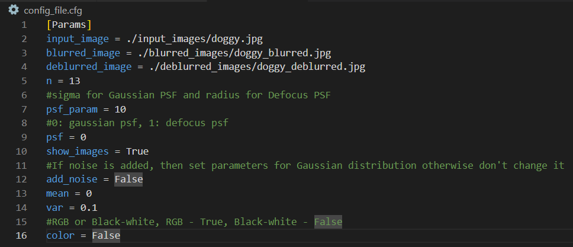
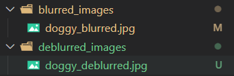
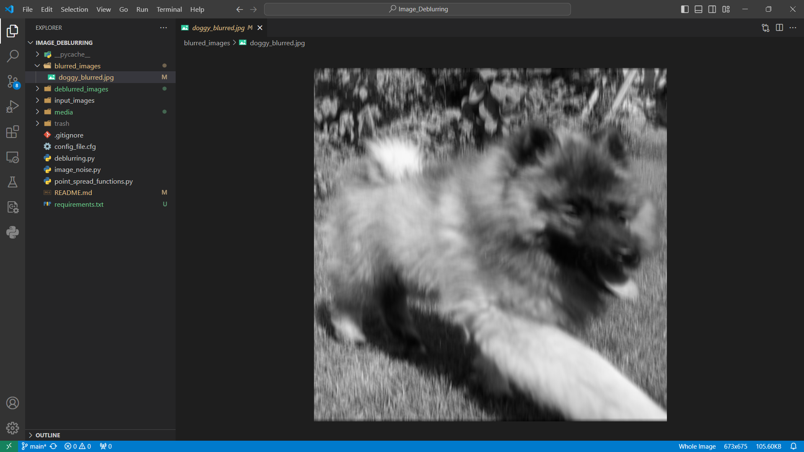
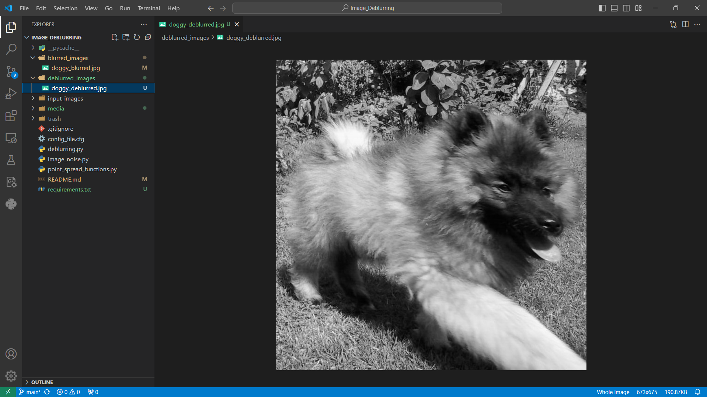

# Image_Deblurring
## Introduction
This repository hosts a semester project on Image Deblurring that uses aspects of linear algebra. Our team:

- [Artur](https://github.com/PelArtur)
- [Anastasiia](https://github.com/Drakonchyk)
- [Yelyzaveta](https://github.com/lizamashchenko)

Here you can check the effect of the size and density of PSF on the quality of blurring, as well as how it affects the subsequent deblurring of images. As an additional possibility, you can check how noise affects this process.

## Aim
The goal of our project is to investigate how linear algebra can be used in the image deblurring task.

## Run program

### Config file
For launching the program, as well as convenient setting of its parameters, an example config file has been created: `congig_file.cfg`. Its content looks like this:



First you specify the path to your image(`input_image`), as well as the path to save the blurred image(`blurred_image`) and the deblurred image(`deblurred_image`). 

Further, the corresponding parameters are responsible for:
- `psf` — type of PSF, only integet, 0: Gaussian PSF, Defocus PSF.
- `n` — The length of the PSF vector, only integer.
- `psf_param` — Parameter for psf function. For PSF Gaussian it is sigma for defocus it is radius, integer or float. 
- `show_images` — If it is True, then at the end the program will create three windows in which it will show the initial image, the blurred image and the deblurred image. Otherwise, nothing will be done.
- `add_noise` — If True, adds noise to the blur matrix, otherwise nothing is done.
- `mean` and `var` — Gaussian distribution values ​​for noise generation, used only if `add_noise` is True.
- `color` — Determines what color the image will be. If color is True, then the image is multi-colored, otherwise it is black and white.

### Prerequisites
Before running the program, make sure that all libraries are loaded, if not, run this command:

```
pip install -r requirements.txt
```

### Running program
After all the libraries have been downloaded and the config file is configured, you can assume to start the programs. To do this, add the path to your config file to the startup parameters:

```
python ./deblurring.py ./config_file.cfg
```

Here is an example of running program with the default config:


### Results

After the program ends, two files will be saved in the paths you specified:



Where you will get a saved copy of the blurred image:



And deblurred:

